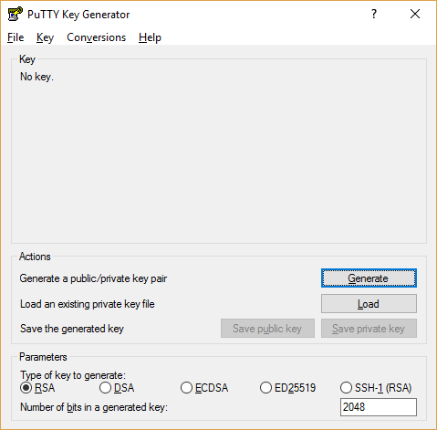
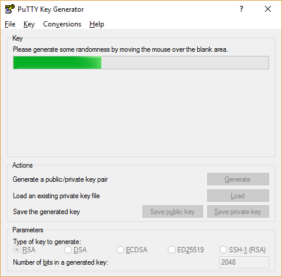
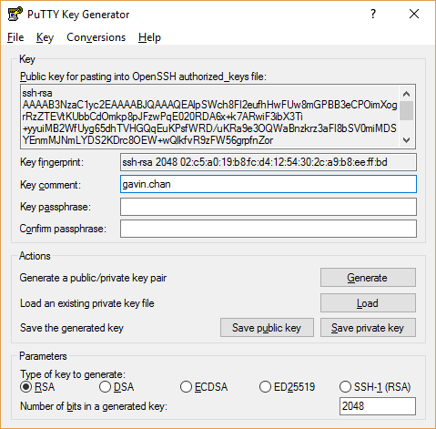
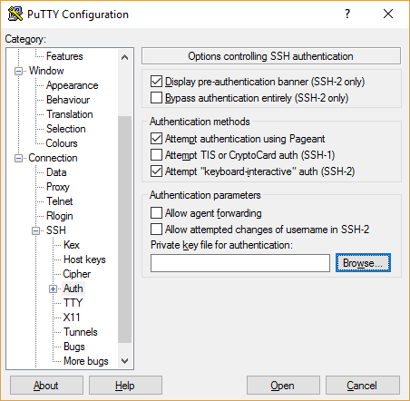

# Generating SSH Key

## Download the latest putty application

Go to the putty official [website](http://www.chiark.greenend.org.uk/~sgtatham/putty/latest.html)
and download the latest putty msi.

## Open PuTTYGen

After installation, open the application PuTTYGen. 

Select **RSA** as the "Type of key to generate" at the bottom. Then click **Generate**.

Follow the instruction to flip your mouse around. 

Then leave your name in the **Key comment** and your own defined password
in the **Key passphrase**. The passphrase is the password to access with 
the SSH key.

Finally click save your public and private key in separate. Send your public key to me. :)

## Access with SSH Private Key.

After the admin added your public key (might take 1-2 days), you can log on to the server.

Open your putty application. In the configuration, go to **Connection**->**SSH**->**Auth**.

Put back the path of your private key. 

Click **Open** and put in your key passphrase. Welcome to the world.